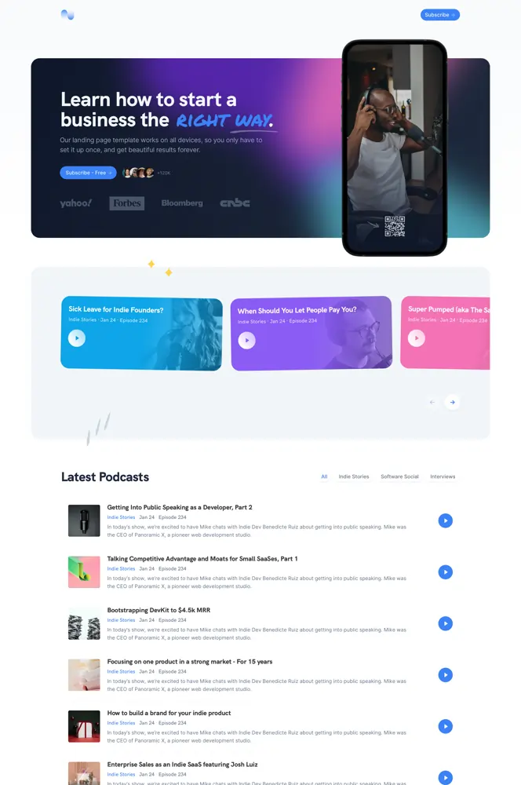
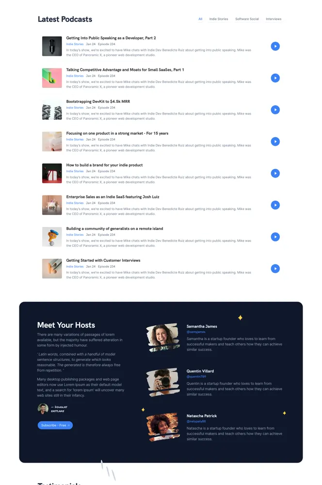

# podcast Baklib CMS Template

A fabulous podcast website template for hosting and sharing your shows.

HTML landing page template deployed by Baklib CMS.




## 🚀 Project Structure

```
  .
  ├── README.md
  ├── config
  │   └── settings_schema.json
  ├── layout
  │   └── theme.liquid
  ├── package-lock.json
  ├── package.json
  ├── snippets
  │   ├── _breadcrumb.liquid
  │   ├── _feedback_form.liquid
  │   ├── _footer.liquid
  │   └── _header.liquid
  ├── statics
  │   ├── index.liquid
  │   ├── reset-password.liquid
  │   ├── schedule-call.liquid
  │   └── signin.liquid
  ├── tailwind.config.js
  ├── templates
  │   ├── index.liquid
  │   ├── page.liquid
  │   ├── search.liquid
  │   └── tag.liquid
  ├── yarn-error.log
  └── yarn.lock
```


## 🧞 Install guide

This HTML template is shipped with the (Tailwind CLI tool)[https://tailwindcss.com/docs/installation].

The Template install Guide: https://help.baklib.cn/themes/podcast

The Baklib template install Guide: https://dev.baklib.cn/guide/git